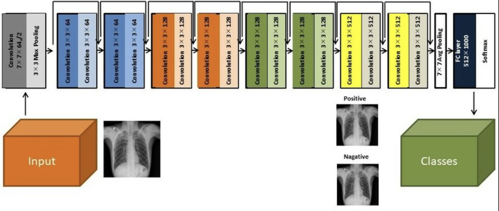

# Pneumonia Classification from X-Ray Image using CNN

## 1. Overview
This project aims to detect pneumonia from X-ray images using a Convolutional Neural Network (CNN). Early detection of pneumonia is crucial as it can lead to severe health complications or even death if untreated.  
The dataset is sourced from Kaggle

## 2. Model Used
#### ResNet-18 Architecture
We utilized the ResNet-18 architecture, a Convolutional Neural Network (CNN) that enhances feature extraction through residual learning. The model classifies X-ray images as pneumonia-positive or not, using convolutional, pooling, and fully connected layers.

  

#### Other Methods
Adapted ResNet-18 for grayscale images by changing input channels to 1.   
Applied data augmentation techniques for robustness.   
Leveraged pre-trained weights from ImageNet to accelerate convergence and enhance feature extraction.   
Fine-tuned the model by updating weights through backpropagation, adjusting the learning rate, and employing gradient clipping to prevent overfitting.

## 3. Result
The Threshold used here is 0.25 (min false negatives)

  

